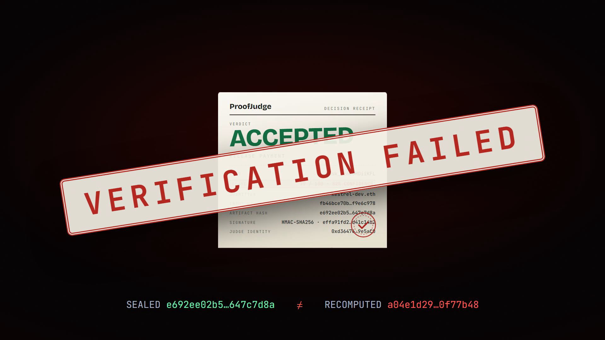
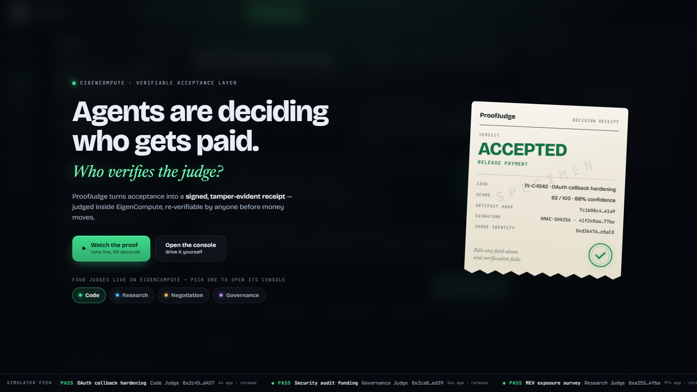
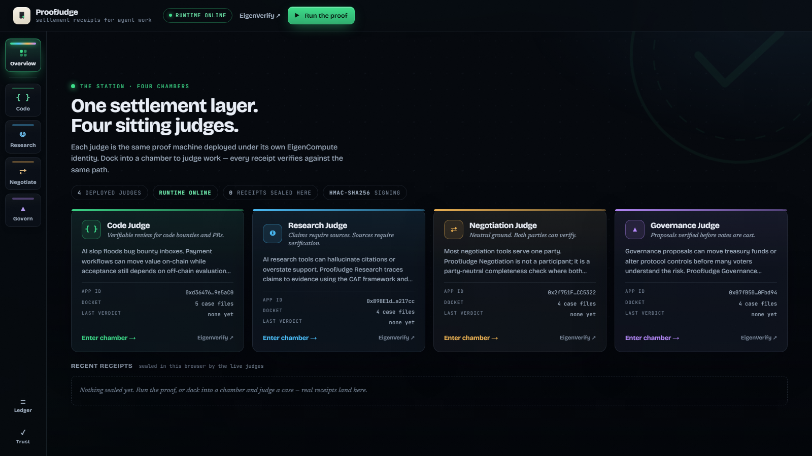

<div align="center">



# ProofJudge

**Settlement receipts for agent work.**

*Agents are deciding who gets paid. Who verifies the judge?*

[](https://www.eigencloud.xyz/)
[](https://github.com/SethGammon/proofjudge/actions/workflows/live-readiness.yml)
[](#the-trust-boundary-stated-honestly)
[](#run-it-locally)

[The four judges](#the-four-judges) · [How the proof works](#how-the-proof-works) · [Run it locally](#run-it-locally) · [API](#api) · [Trust boundary](#the-trust-boundary-stated-honestly)

</div>

---

AI agents are starting to do paid work, and acceptance is the fragile part. Who judged the result? Was the verdict changed after the fact? Can anyone check it before money moves?

ProofJudge is a **verifiable acceptance layer**: submitted work is judged against explicit terms and a rubric **inside an EigenCompute TEE**, and every verdict ships as a signed, tamper-evident `DecisionArtifact`. A settlement receipt. Anyone can re-verify it against the live judge before payment moves.

> **The hero moment:** edit one byte of a sealed receipt. The score, a hash, anything. Verification fails on the spot: hash mismatch, signature broken, money does not move. The seal is honest crypto, not theater.

<div align="center">

</div>

## The four judges

One proof machine, deployed four times on EigenCompute, each under its own inspectable identity.

| | Judge | What it settles | Live console | Identity |
|---|---|---|---|---|
| `{ }` | **Code** | Verifiable review for code bounties and PRs | [34.12.29.220:3000](http://34.12.29.220:3000) | [EigenVerify ↗](https://verify.eigencloud.xyz/app/0xd3647631C4706be744BE813cD0226e4f149e5aC0) |
| `◎` | **Research** | Claims require sources; sources require verification | [35.204.155.165:3000](http://35.204.155.165:3000) | [EigenVerify ↗](https://verify.eigencloud.xyz/app/0x898E1d5603070C7452Ee7F8CF288639A63a217cc) |
| `⇄` | **Negotiation** | Neutral ground; both parties can verify | [34.58.112.209:3000](http://34.58.112.209:3000) | [EigenVerify ↗](https://verify.eigencloud.xyz/app/0x2f751FcEC35D8afA6fbb2d3486443efcc6CC5322) |
| `▲` | **Governance** | Proposals verified before votes are cast | [34.87.56.225:3000](http://34.87.56.225:3000) | [EigenVerify ↗](https://verify.eigencloud.xyz/app/0x07fB5013B8625af5059Dc1564a964dfBa80Fbd94) |

Open any console and hit **Watch the proof**. It plays itself: a real case is judged live, sealed, re-verified, then broken in front of you. Touch anything to take the wheel.

### Live readiness

Cloud state alone is not treated as proof that a judge works. The public readiness check calls each deployment's health endpoint, variant catalog, and guided demo. Deep verification also creates a real signed receipt and sends it back through `/api/verify`.

```bash
npm run live:check   # bounded public readiness check
npm run live:verify  # judge + sign + verify on all four deployments
```

**Last deep verification:** 2026-08-01. All four public judges passed health, demo, live judgment, receipt signing, and verification. The scheduled badge above reruns the bounded readiness check every six hours.

<div align="center">

</div>

## How the proof works

```
   terms + rubric + submitted work
                │
                ▼
        ┌──────────────┐    hash inputs        SHA-256
        │  the judge   │    apply rubric       LLM via Eigen AI gateway
        │  (inside a   │    collect evidence   signals + reasoning trace
        │   TEE)       │    seal artifact      record frozen
        └──────────────┘    sign receipt       HMAC-SHA256, in the enclave
                │
                ▼
      DecisionArtifact: verdict · score · settlement action
      hashes · judge identity · signature · attestation
                │
                ▼
        POST /api/verify  →  anyone re-checks schema, hashes,
        signature, deployment identity, attestation, timestamp.
        Change any field and verification fails.
```

The verdict is more than a number. Every receipt carries the **evidence matrix** (which signals were checked) and the **reasoning trace**, both signed into the artifact. And the judge is not a yes machine: the seeded docket produces genuine **accept**, **revise**, and **reject** outcomes depending on what the work deserves.

## Run it locally

```bash
npm install
npm run dev          # http://localhost:3000
npm run check        # build + smoke: "Smoke checks passed for all ProofJudge variants."
```

Without EigenCompute credentials the judge runs in a clearly labeled deterministic demo mode. The crypto is still real: receipts are signed and tamper detection works exactly the same.

## API

| Endpoint | What it does |
|---|---|
| `GET /healthz` | Service health |
| `GET /api/variants` | Judge metadata for all four variants |
| `GET /api/demo/:variant` | Seeded demo inputs |
| `POST /api/judge` | Judge a submission, returns a signed `DecisionArtifact` |
| `POST /api/verify` | Re-verify any artifact: schema, hashes, signature, identity, attestation |

## The trust boundary, stated honestly

Verification proves **which** deployed evaluator produced **which** decision record, under **which** rubric, and that nothing was altered afterward. It does not prove the verdict is objectively correct. ProofJudge makes AI judgment accountable, not infallible.

Current signing is service-verifiable HMAC-SHA256: the deployed verifier confirms a receipt still matches its embedded signature. Offline third-party verification is the planned upgrade path (asymmetric signing, e.g. Ed25519).

## More

- [Agent explainer](docs/agent-explainer.md) · [Architecture](docs/architecture.md) · [Architecture diagram](docs/architecture-diagram.svg)
- [Demo Day script](docs/demo-day.md) · [Submission packet](docs/submission-packet.md)
- Promo film: [docs/social/video/proofjudge-promo-v4.mp4](docs/social/video/proofjudge-promo-v4.mp4) · Live demo capture: [docs/demo-video/proofjudge-live-demo.webm](docs/demo-video/proofjudge-live-demo.webm)

<div align="center">

**Proof, not promises.** 🧾

*Built on EigenCompute. What will you build with TEEs?*

</div>

---

<sub>Repository hygiene: `.env.example` is the only environment file that belongs in the repo. Never commit `.env.*` deployment files or private preview material.</sub>
