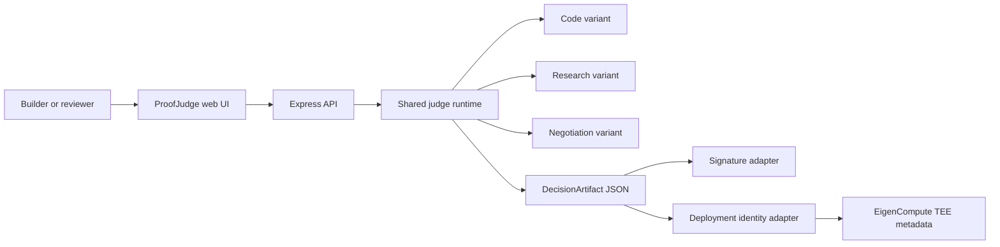
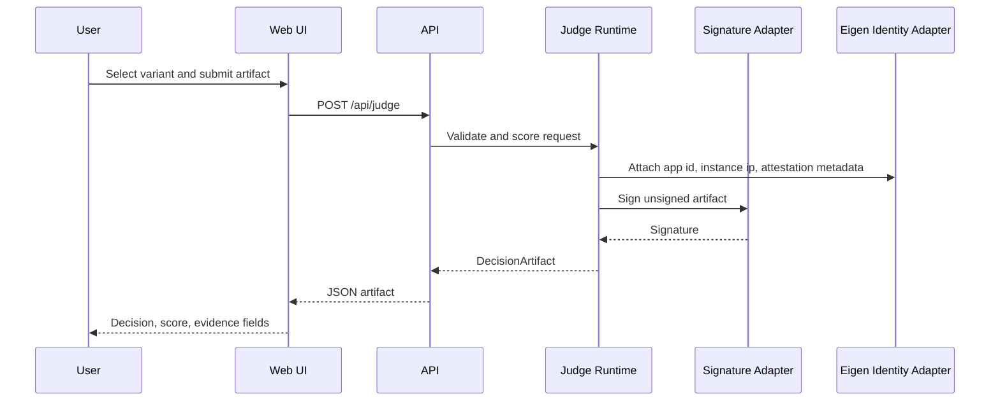

# ProofJudge Architecture

## System View

## Request Flow

## Boundaries

- `src/server.ts` owns HTTP routing and static asset serving.
- `src/judge.ts` owns request validation, scoring, artifact construction, and signing.
- `src/variants.ts` owns variant-specific configuration and seeded examples.
- `src/public/*` owns the Demo Day UI.
- `docs/*` owns submission material.

## EigenCloud Integration Points

- Docker runtime binds to `0.0.0.0:${PORT}`.
- Dockerfile keeps `USER root`, matching the quickstart constraint for EigenCompute alpha deployment.
- Deployment metadata is injected through `EIGEN_APP_ID`, `EIGEN_INSTANCE_IP`, and `EIGEN_ATTESTATION_ENDPOINT`.
- The current app labels missing attestation values as `demo-placeholder`.

## Future Integrations

- Replace deterministic local scoring with EigenCloud LLM proxy calls.
- Store artifacts in persistent encrypted state when AgentKit-compatible storage is available.
- Anchor decision hashes onchain.
- Verify TEE attestation in the UI before showing a decision as externally verifiable.
